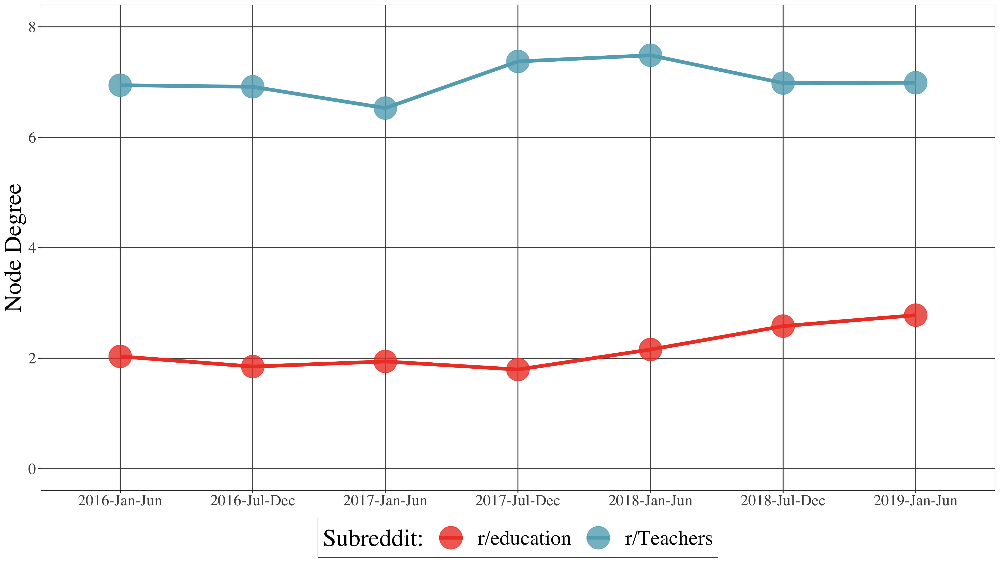
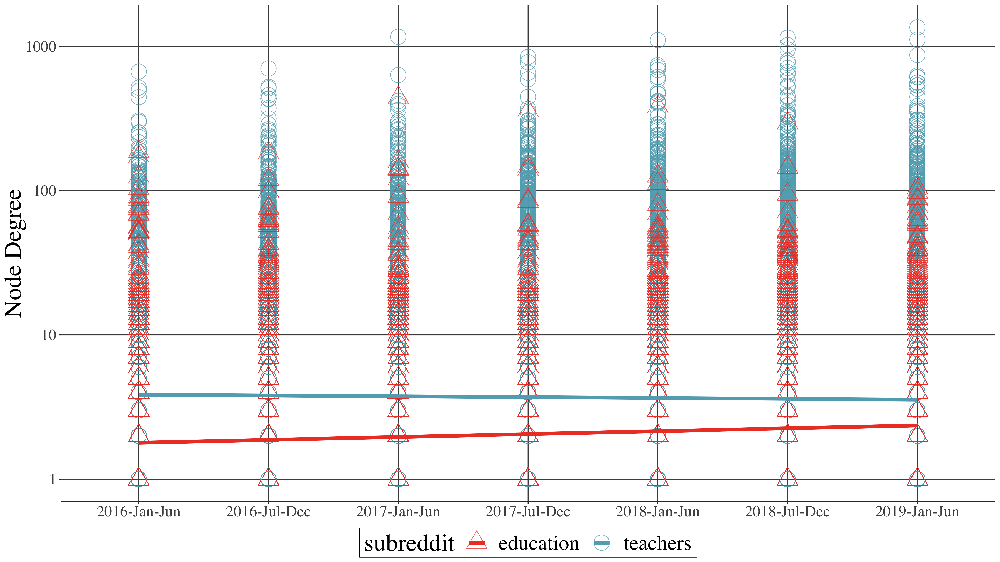
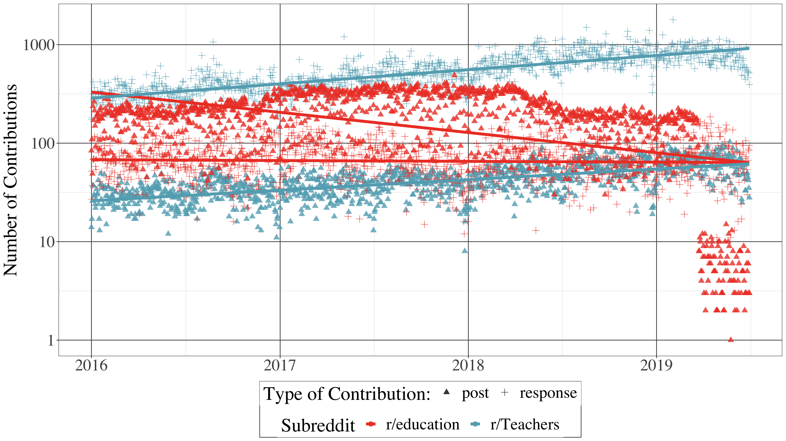
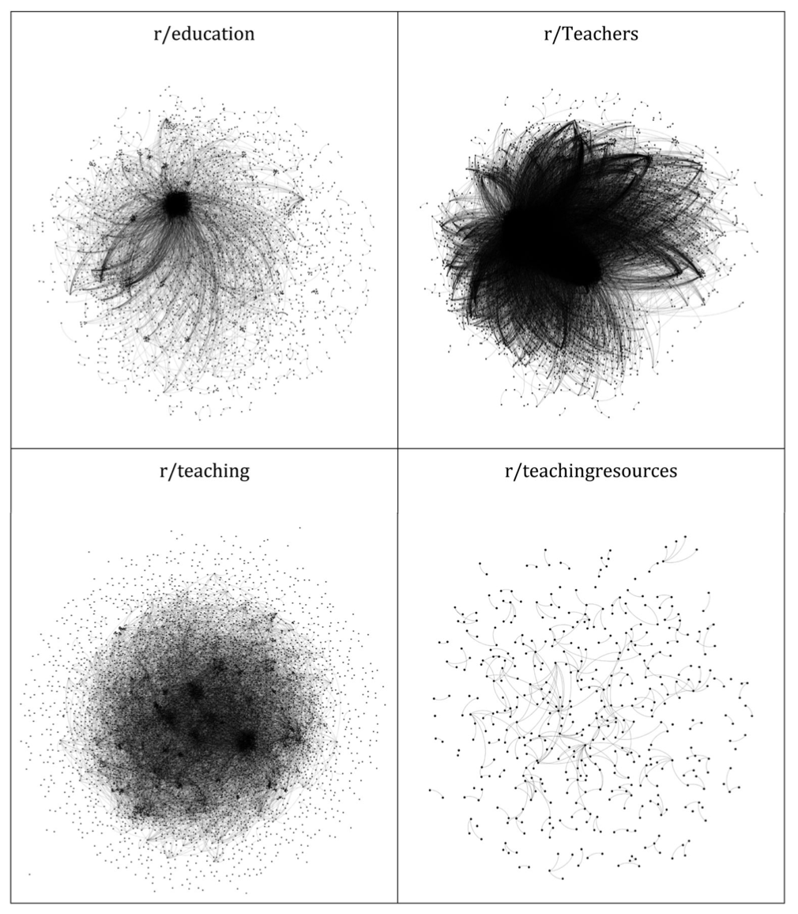
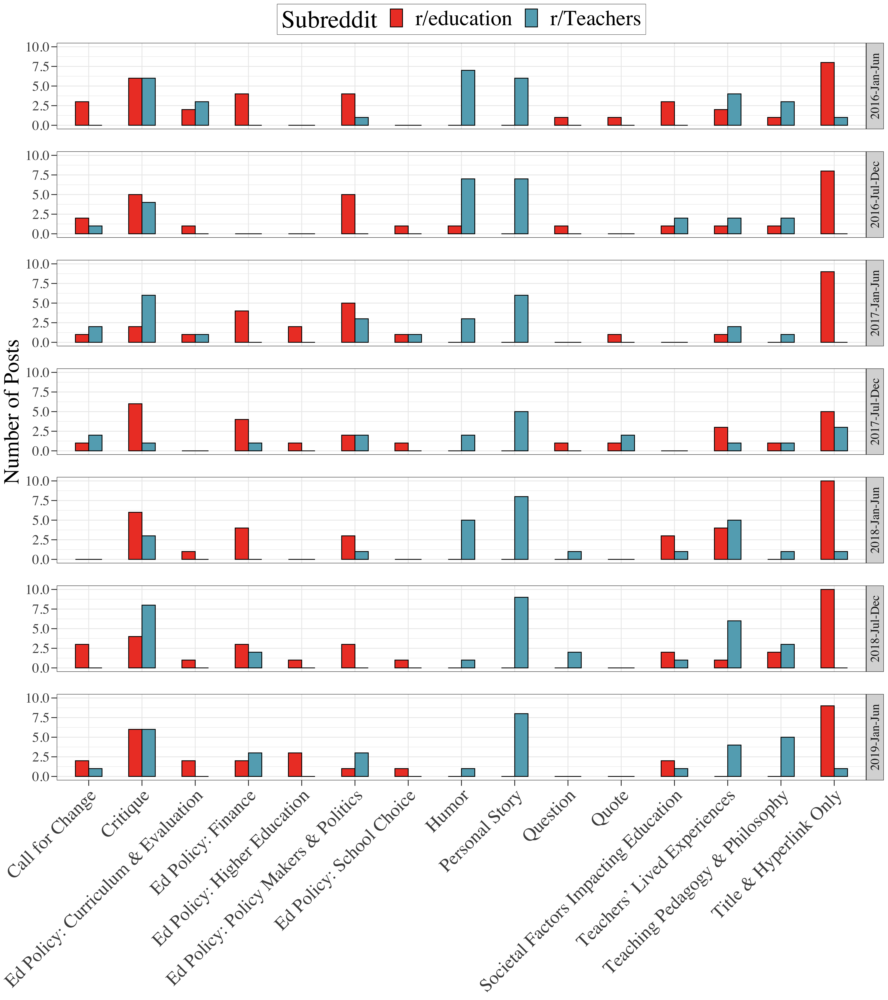
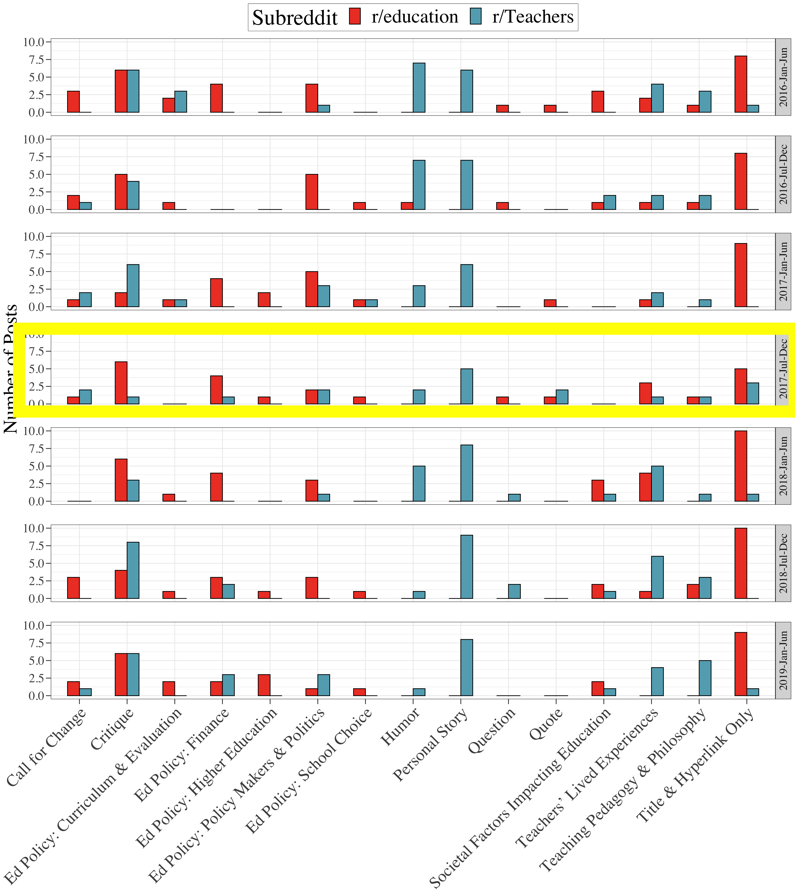

```{r setup, include=FALSE}
usethis::use_git_ignore(c("*.csv", "*.rds"))
options(htmltools.dir.version = FALSE)

library(knitr)
library(tidyverse)
library(xaringan)
library(fontawesome)
```

class: inverse, center, middle

# `r fa("far fa-images", fill = "#fff")`

**View the slides:** [bretsw.github.io/manhattanville-lecture-ss22](https://bretsw.github.io/manhattanville-lecture-ss22)

---

class: inverse, center, middle

# `r fa("fas fa-dice-one", fill = "#fff")` `r fa("fas fa-dice-two", fill = "#fff")` `r fa("fas fa-dice-three", fill = "#fff")` `r fa("fas fa-dice-four", fill = "#fff")` <br><br> Four Examples

---

class: inverse, center, middle

# `r fa("fas fa-dice-one", fill = "#fff")` <br><br> Example \#1 <br><br> `r fa("fab fa-uncharted", fill = "#fff")` Uncertainty

---

# `r fa("fas fa-dice-one", fill = "#fff")` Uncertainty

```{r, out.width = "100%", echo = FALSE, fig.align = "center"}

```

---

# `r fa("fas fa-dice-one", fill = "#fff")` Uncertainty

```{r, out.width = "100%", echo = FALSE, fig.align = "center"}

```

---

# `r fa("fas fa-dice-one", fill = "#fff")` Uncertainty

```{r, out.width = "100%", echo = FALSE, fig.align = "center"}

```

---

# `r fa("fas fa-dice-one", fill = "#fff")` Uncertainty

```{r, out.width = "100%", echo = FALSE, fig.align = "center"}

```

---

class: inverse, center, middle

# `r fa("fas fa-dice-two", fill = "#fff")` <br><br> Example \#2 <br><br> `r fa("fas fa-hourglass-half", fill = "#fff")` Time

---

# `r fa("fas fa-dice-two", fill = "#fff")` Time

```{r, out.width = "720px", echo = FALSE, fig.align = "center"}
include_graphics("img/2-fig1.png")
```

---

# `r fa("fas fa-dice-two", fill = "#fff")` Time

```{r, out.width = "100%", echo = FALSE, fig.align = "center"}

```

---

# `r fa("fas fa-dice-two", fill = "#fff")` Time

```{r, out.width = "100%", echo = FALSE, fig.align = "center"}

```

---

# `r fa("fas fa-dice-two", fill = "#fff")` Time

```{r, out.width = "560px", echo = FALSE, fig.align = "center"}

```

---

class: inverse, center, middle

# `r fa("fas fa-dice-three", fill = "#fff")` <br><br> Example \#3 <br><br> `r fa("fas fa-share-alt", fill = "#fff")` Networks

---

# `r fa("fas fa-dice-three", fill = "#fff")` Networks

```{r, out.width = "100%", echo = FALSE, fig.align = "center"}
include_graphics("img/3-fig1.png")
```

---

# `r fa("fas fa-dice-three", fill = "#fff")` Networks

```{r, out.width = "100%", echo = FALSE, fig.align = "center"}

```

---

# `r fa("fas fa-dice-three", fill = "#fff")` Networks

```{r, out.width = "480px", echo = FALSE, fig.align = "center"}

```

---

# `r fa("fas fa-dice-three", fill = "#fff")` Networks

```{r, out.width = "480px", echo = FALSE, fig.align = "center"}
include_graphics("img/3-fig4.png")
```

---

class: inverse, center, middle

# `r fa("fas fa-dice-four", fill = "#fff")` <br><br> Example \#4 <br><br> `r fa("fas fa-comments", fill = "#fff")` Topics

---

# `r fa("fas fa-dice-four", fill = "#fff")` Topics

```{r, out.width = "480px", echo = FALSE, fig.align = "center"}

```

---

# `r fa("fas fa-dice-four", fill = "#fff")` Topics

```{r, out.width = "480px", echo = FALSE, fig.align = "center"}

```

---

# `r fa("fas fa-dice-four", fill = "#fff")` Topics

```{r, out.width = "360px", echo = FALSE, fig.align = "center"}
include_graphics("img/4-fig3.png")
```

---

# `r fa("fas fa-dice-four", fill = "#fff")` Topics

```{r, out.width = "100%", echo = FALSE, fig.align = "center"}
include_graphics("img/4-fig4.png")
```

---

class: inverse, center, middle

# `r fa("far fa-question-circle", fill = "#fff")` <br><br> Questions

<hr>

`r fa("envelope", fill = "white")` [bret.staudtwillet@fsu.edu](mailto:bret.staudtwillet@fsu.edu) | `r fa("twitter", fill = "white")` [@bretsw](https://twitter.com/bretsw) | `r fa("globe", fill = "white")` [bretsw.com](http://bretsw.com) | `r fa("fab fa-github", fill = "#fff")` [GitHub](https://github.com/bretsw/)